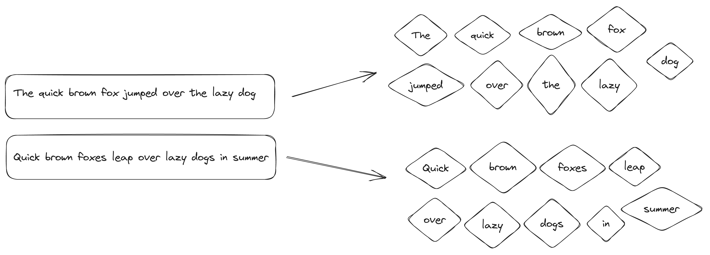
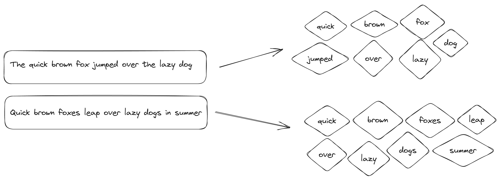
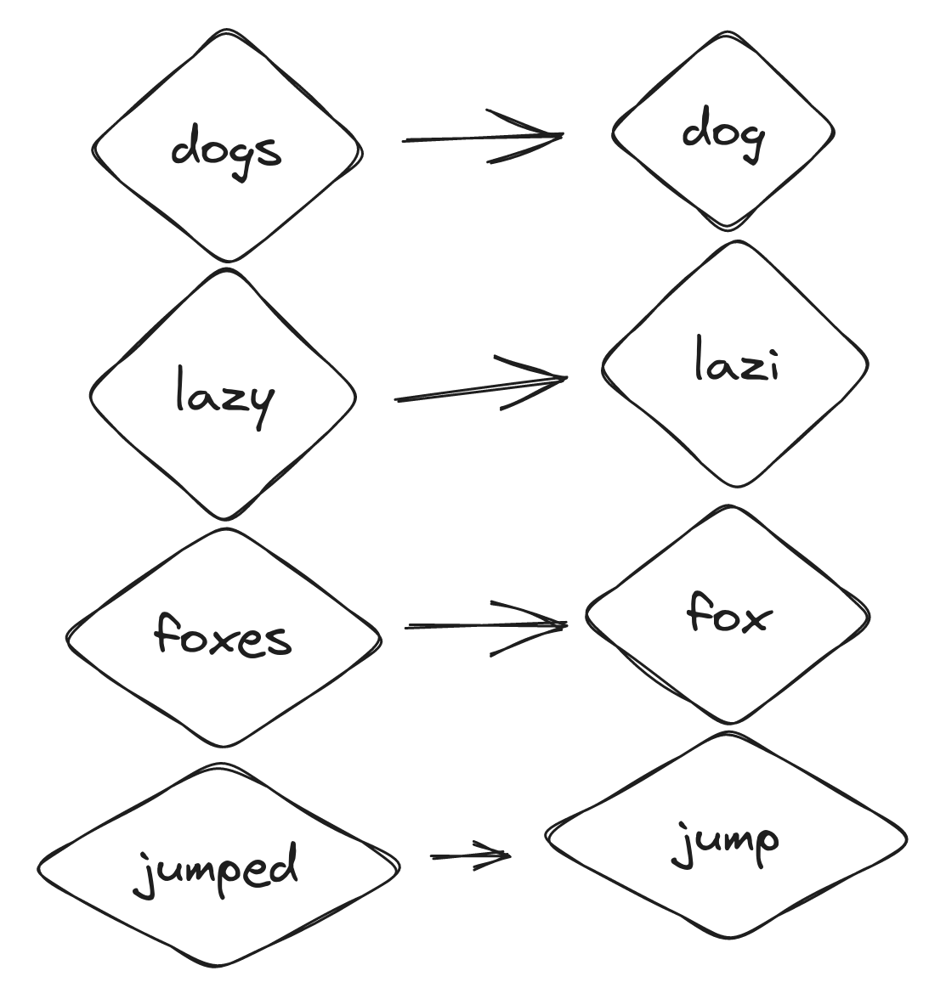
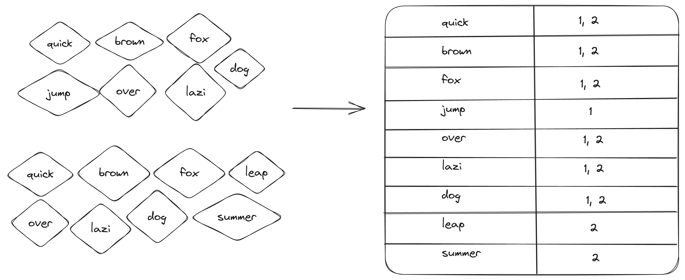

I was curious about inverted indexes and wanted to better understand them by practicing in Rust. 
To do this, I built a minimal inverted index and documented the process in this article. 
Although my implementation is currently limited, the experience helped me learn a lot
and identify areas for improvement in the future. 
If you're willing to skip the theory, go ahead and get started with the [Let's Build section](#lets-build).

# Overview
To start, let's give a brief overview of the inverted index and where to locate it.
Whenever you search for something on the web, such as adorable puppies or search logs on ElasticSearch,
the search engine uses an inverted index in the background.

Every search engine operates in its own unique way, tailored to its specific purpose.
However, at its nature, a full-text search typically requires an inverted index. 
Of course, you can use things like regular expression and such stuff, but it will be less efficient in many terms for this kind of problem.
Many databases now support full-text search, whether OLAP or OLTP database.

For example:
* PostgreSQL has [GIN](https://www.postgresql.org/docs/current/gin-intro.html)
* ClickHouse has an [experimental](https://clickhouse.com/docs/en/engines/table-engines/mergetree-family/invertedindexes) feature to create an inverted index.

You can plug an inverted index anywhere.


# Basic parts
## Text analysis
In this section, I will provide an explanation of the inverted index and how we can prepare our text for later searching.
For instance, let's say we have two phrases: 

`"The quick brown fox jumped over the lazy dog"`

`"Quick brown foxes leap over lazy dogs in summer." `

What steps should we take to locate both documents with the "brown foxes" search query?

To begin, let's tokenize our text. Tokenization involves creating individual tokens, which essentially means splitting up the words.
The most basic way to tokenize is by creating a method that separates words using whitespace while getting rid of any punctuation symbols.
However, there are some downsides to this method which we will discuss shortly when I reveal the tokenizer I choose to use.


We have separated our words into tokens, but they are in different cases.
In order to perform a case-insensitive search that is not affected by capitalization, the text needs to be normalized. 
This means that all words should be converted to lowercase, such as "Quick" becoming "quick."

Another technique we will apply is to remove `stop-words` - tokens that aren't necessary for storing and searching information.
For example, we'll filter out words like `the` and `is`. There is no universal list of stop-words, but some projects have compiled lists.
Stop-words are used in text searches and natural language processing. By filtering out these words, our index takes up less space. 
In my code, I mostly use stop-word lists from the Snowball project. 
Here is an example of the stop-word list for the [Hungarian](https://snowballstem.org/algorithms/hungarian/stop.txt) language. 
After we make all tokens lowercase and filter out stop-words, our text will look like this:



We will utilize stemming as a final technique. This involves transforming each word to its base form.



As a result, when searching for "brown foxes", both "foxes" and "fox" will be included as they are now represented by the same "fox" token.
Tokenization and normalization techniques will be applied to the text during indexing and search queries.

## Index text
Now we want to store all these tokens and associate them with given phrases so that later on, we can perform a search.
Here is the place where the Inverted Index comes into the scene.

There are various approaches to implementing it, but essentially, it involves creating a connection between the token and the document ID.
In our example, each phrase will be a different document. We will assign id = 1 to this document "The quick brown fox jumped over the lazy dog" and id = 2 to "Quick brown foxes leap over lazy dogs in summer".
Our mapping will be like this: `quick: [1,2], brown: [1,2] lazi: [2]` and so on.

The reason why an inverted index is called "inverted" is that it maps tokens to IDs, rather than the other way around, where IDs are mapped to words.



This image shows one of the methods for creating an inverted index.

While we currently utilize HashMap, there is also the option to use Trie, which we will cover at a later time.
## Search text
The search process will be simple:
* tokenize the query to tokens,
* normalize it using the same technique,
* find the intersection of IDs for given tokens.

# Let's build
## Tokenizer
Let’s start with the `tokenizer`:

```rust
    pub fn tokenize(&self, text: &str) -> impl Iterator<Item = String> {
        text.chars()
            .filter(|c| !c.is_ascii_punctuation())
            .collect::<String>()
            .split_whitespace()
            .map(str::to_string)
            .collect::<Vec<String>>()
            .into_iter()
    }
```
Here is one of the first versions of my tokenizer:

* filter out punctuation characters,
* allocate new `String` with remaining characters,
* split it by whitespace,
* collect the result to Vector and return the iterator to it.

In the initial version, I returned Vector. However, I realized that all methods using the tokenize method had to call the `.iter()` method separately,
which was inconvenient. Therefore, I chose to immediately return the iterator instead. 
For consistency and efficiency, I also decided to return an iterator in other methods.

Splitting a string by its whitespace and removing punctuation is easy to code and understand, but it can lead to unintended errors,
for example, when dealing with specific English words.
If we tokenize "I'm," we may end up with "Im," which could cause confusion.
Even if it is not a significant issue, it highlights the importance of cautiousness when selecting a tokenization approach.
Additionally, as different languages have unique rules, it is essential to ensure that our approach can handle them at its best.
For example, Chinese, Japanese, Thai, Lao, and Khmer do not use spaces to separate words.

This version of the tokenizer will still divide text in such languages into characters rather than words,
but it's better than including an entire string.
For such languages, we should develop special tokenizers.

I use the Unicode [Segmentation technique](http://www.unicode.org/reports/tr29/) in the final version to split text into unicode words;
this [crate](https://docs.rs/unicode-segmentation/latest/unicode_segmentation/) helps achieve that.
```rust
pub fn tokenize(&self, text: &str) -> impl Iterator<Item = String> {
        text.unicode_words()
            .map(str::to_string)
            .collect::<Vec<String>>()
            .into_iter()
    }
```

### Lowercase
The lowercase method is straightforward, and I don't have much to say about it:

```rust
pub fn lowercase<I>(&self, tokens: I) -> impl Iterator<Item = String>
    where
        I: Iterator<Item = String>,
    {
        tokens.map(|s| s.to_lowercase())
    }
```

### Stop-words
I got my stop-word lists from [Snowball](https://snowballstem.org/) and
[Stopwords ISO](https://github.com/stopwords-iso) projects.
When you create the `Filter`, you pass language value from the `Language` enum.

```rust
pub fn new(language: Language) -> Self {
        Filters {
            stop_words_list: language.get_stopwords(),
            stemmer: Stemmer::create(language.get()),
        }
    }
```
In future updates, I plan to using language detection so that it will no longer be necessary to specify the language when creating a filter.

Stop-words are HashSet, so I filter tokens from stop words by calling `.difference()` method.
```rust
pub fn stop_words<I>(&self, tokens: I) -> impl Iterator<Item = String>
    where
        I: Iterator<Item = String>,
    {
        let set_of_tokens: HashSet<String> = tokens.into_iter().collect();
        set_of_tokens
            .difference(&self.stop_words_list)
            .cloned()
            .collect::<Vec<String>>()
            .into_iter()
    }
```

### Stemming
My project supports multiple languages thanks to a [rust-stemmers](https://docs.rs/rust-stemmers/1.2.0/rust_stemmers/) crate that can handle them.

```rust
pub fn stemming<'a, I>(&'a self, tokens: I) -> impl Iterator<Item = String> + 'a
    where
        I: Iterator<Item = String> + 'a,
    {
        tokens.map(|t| match self.stemmer.stem(&t) {
            Cow::Owned(stemmed_str) => stemmed_str,
            Cow::Borrowed(stemmed_str) => stemmed_str.to_string(),
        })
    }
```

## Index
In order to create an Inverted Index, I utilized a HashMap that had a String key and a HashSet value.
The String represents a token and the HashSet holds the document IDs that contain that token.

```rust
pub struct InvertedIndex {
    idx: HashMap<String, HashSet<u64>>,
    analyzer: Analyzer,
}
```

For my implementation, I chose to use HashMap because it is easy to implement, and it's faster than BTreeMap. 
In addition, I opted for HashSet to maintain unique IDs and utilize `set` properties like `intersection` and `union`.

However, I discovered that this approach may not be the most efficient for building an Inverted Index.
During my research, I came across a blog post by Andrew Gallant (also known as burntsushi)
[Index 1,600,000,000 Keys with Automata and Rust](https://blog.burntsushi.net/transducers/). 
If you are interested in indexing, state machines, or Tries, I highly recommend checking it out.
The post discusses using Finite State Machines (FSMs) for indexing keys. 
FSMs can be represented as Tries, but they can also be compressed using a DAG/FSM and share suffixes (in Tries, only prefixes are shared).
Lucene and FSTs also utilize this approach, and Tantivy uses the fork of burntsushi's crate for FSTs.

For future iterations, I plan to try using FST or plain Trie and compare its performance to my current implementation.

The process of indexing a document is straightforward. It involves running filters on the document and then adding document IDs to a set.
```rust
pub fn add(&mut self, docs: &[Document]) {
        for doc in docs.iter() {
            for token in self.analyzer.analyze(doc.text.as_str()) {
                match self.idx.get_mut(&*token) {
                    None => {
                        let v = HashSet::from([doc.id]);
                        self.idx.insert(token, v);
                    }
                    Some(v) => {
                        v.insert(doc.id);
                    }
                }
            }
        }
    }
```

At present, the current implementation lacks support for OR operations in queries, it is easy to comprehend. 
Upon receiving a query, we apply the same filters and identify the IDs that match the given tokens.

In the future, to speed up the response time for the user, we can stop iterating once we find K matching documents. 
This is beneficial because often, users only require the top K matching documents rather than all of them.

```rust
pub fn search(&self, text: &str) -> HashSet<u64> {
        let mut result: HashSet<u64> = HashSet::new();
        for token in self.analyzer.analyze(text) {
            match self.idx.get(&*token) {
                None => {}
                Some(ids) => {
                    if result.is_empty() {
                        result = ids.clone();
                    }
                    result = result.intersection(ids).copied().collect();
                }
            }
        }

        result
    }
```

# Afterwords

While there is still room for improvement and further research, the current implementation has already helped me grasp some basic principles.
As we continue with subsequent iterations, I will delve deeper and share with you the additional insights I acquire.

# Reading materials

[Index 1,600,000,000 Keys with Automata and Rust](https://blog.burntsushi.net/transducers/)

[Tantivy Architecture](https://github.com/quickwit-oss/tantivy/blob/main/ARCHITECTURE.md)

[Elasticsearch from the Bottom Up, Part 1](https://www.elastic.co/blog/found-elasticsearch-from-the-bottom-up)
